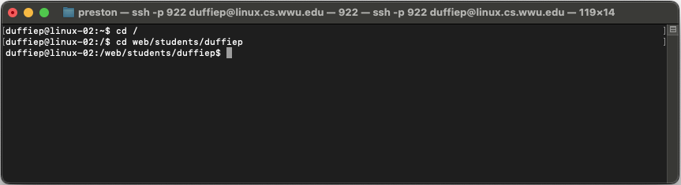

# Uploading to Department Web Hosting

This document will walk you through setup of the **studentweb** folder and subfolders, and the uploading of documents to the WWU computer science department web hosting using.

> [!NOTE]
> To see an up to date list of CS Lab rooms visit: <https://support.cs.wwu.edu/home/survival_guide/resources/Labs.html>

---

## Option 1: Log into a Linux machine on campus

Follow these instructions if you are on campus and in a Linux lab. You will need a method to transfer your lab files onto the lab computer (flash drive, email, SCP, etc.). Once you have a method of transferring your lab files follow these steps.

1. Log into the lab computer. This will be your WWU CS login (this is different from your standard WWU login). If you forgot your login, you can reset your password via <https://password.cs.wwu.edu/>

2. Open a file explorer (Activities > Files) and locate your Lab files, these may be on a flashdrive or where ever you put them.

3. Open a new file explorer window (Files > New Window) and navigate to the "Other Locations" tab.

4. Select "Debian GNU/Linux". You will see a list of many folders (academic, bin, boot, etc.). Ignore these and scroll down until you see the "web" folder.

5. Select the "web" folder and then the "students" directory. This may load for a moment.

6. Search for your WWU username, you may want to utilize the search feature. Enter into this subfolder.

7. This is where you will upload your lab files, this should include your "secret folder".

> [!CAUTION]
> Make sure none of your files have spaces in them, instead use underscore '\_' or dash '-'.

8. Notice the file path at the top of the file explorer, this will be similar to your URL that you will submit.

9. Navigate to a browser and type the following URL:
   `https://studentweb.cs.wwu.edu/~/username/super_secret/lab3/index.html`

   - Replace `username` with your WWU username.
   - Replace `super_secret` with your secret folder name.
   - Replace `lab3` with the name of the folder containing your lab files.
   - Replace `index.html` with the name of your index file if needed.

10. Confirm that your website is appearing in a browser. Once confirmed, **this will be the URL that you submit**.

11. Congrats! You've uploaded to the web drive.

## Option 2: Log into a Windows machine on campus

Follow these instructions if you are on campus and in a Windows lab. You will need a method to transfer your lab files onto the lab computer (flash drive, email, SCP, etc.). Once you have a method of transferring your lab files follow these steps.

> [!TIP]
> If a computer turns on and is using the Linux operating system, and you would like to switch. Shut down the computer and turn it back on. Then select the "Windows" option with the arrow keys when the computer boots up.

> [!WARNING]
> You will not be able to switch to windows if you are in a linux only lab. In this case, follow the steps in option 1.

1. Log into the lab computer. This will be your WWU CS login (this is different from your standard WWU login). If you forgot your login, you can reset your password via <https://password.cs.wwu.edu/>

2. Open  File Explorer and navigate to where you stored your lab files. They may be on a flash drive or where ever you put them.

3. Open a new File Explorer window (Right click File Explorer in the dock and click "File Explorer"). Click "This PC".

4. Click "Web (\\fs1) (W:)" to view the web drive.

5. Click Students.

6. Find your WWU username. You may want to utilize the search feature. Enter into your student directory.

7. In your other File Explorer window, simply drag your secret folder into your student directory. Click on your secret folder and you should see your lab folder.

> [!CAUTION]
> Make sure none of your files have spaces in them, instead use underscore '\_' or dash '-'.

8. Navigate to a browser and type the following URL:
   `https://studentweb.cs.wwu.edu/~/username/super_secret/lab3/index.html`

   - Replace `username` with your WWU username.
   - Replace `super_secret` with your secret folder name.
   - Replace `lab3` with the name of the folder containing your lab files.
   - Replace `index.html` with the name of your index file if needed.

9. Confirm that your website is appearing in a browser. Once confirmed, **this will be the URL that you submit**.

10. Congrats! You've uploaded to the web drive.

## Option 3: Remotely via SSH and FileZilla

Follow the steps in this section if you are trying to upload files from your personal computer while **not** connected to the university wifi.

> [!IMPORTANT]
> If you are connected to the university wifi, you may skip step 1.

1. Connect to the internet through the university VPN.

   1. In a browser open the CS support documentation. <https://support.cs.wwu.edu/home/access/wwu_vpn/index.html>.
   2. Select the operating system (Windows, MacOS, or Linux) and follow the CS support tutorial.

2. Download and install **FileZilla**.

   1. In a browser open <https://filezilla-project.org/download.php?type=client>
   2. Download the FileZilla client, ensure you download the file for your operating system

3. Open FileZilla and locate the quick connect options at the top of the application.

4. Fill out the fields for quick connect:

   - Host: `linux.cs.wwu.edu`
   - Username: `Your WWU CS Username`
   - Password: `Your WWU CS Password`
   - Port: `992`

5. Press "Quickconnect".

> [!TIP]
> If pressing "Quickconnect" does nothing, ensure you have the correct username and password, and double check the port and host. Remember, this is your WWU **CS** login.

6. An "Unknown host key" dialog box will appear asking, simply click "OK". You may optionally select to always trust the host.

7. After a moment you should see files on the right side (Remote Site) of FileZilla.

9. In the "Remote site:" dialog box type:
   `/web/students/username/super_secret`

   - Replace `username` with your WWU username.
   - Replace `super_secret` with your secret folder name.

10. On the left side of FileZilla (Local Site) navigate to your lab via the "Local Site" dialog box, or the user interface. This will be individual for each person, make sure you know exactly where you are storing your files.

11. Simply drag the lab folder from the Local site to the Remote site (left to right). This will upload the files and in a moment you should see the lab folder appear on the Remote site.

> [!CAUTION]
> Make sure none of your files have spaces in them, instead use underscore '\_' or dash '-'.

12. Navigate to a browser and type the following URL:
    `https://studentweb.cs.wwu.edu/~/username/super_secret/lab3/index.html`

    - Replace `username` with your WWU username.
    - Replace `super_secret` with your secret folder name.
    - Replace `lab3` with the name of the folder containing your lab files.
    - Replace `index.html` with the name of your index file if needed.

13. Confirm that your website is appearing in a browser. Once confirmed, **this will be the url that you submit**.

14. Congrats! you've uploaded to the web drive.

## Option 4: Remotely via Terminal, SSH and SCP

Follow the steps in this section if you are trying to upload files from your personal computer while **not** connected to the university wifi.

> [!IMPORTANT]
> If you are connected to the university wifi, you may skip step 1.

> [!WARNING]
> The syntax for commands between Windows and MacOS will vary. Currently the tutorial is only written for MacOS.

### Option 4 - Section 1: Connecting via SSH

1. Connect to the internet through the university VPN.

   1. In a browser open the CS support documentation. <https://support.cs.wwu.edu/home/access/wwu_vpn/index.html>.
   2. Select the operating system (Windows, MacOS, or Linux) and follow the CS support tutorial.

2. Open a new terminal window.

3. SSH into the linux lab computers with the command:
   `ssh -p 922 username@linux.cs.wwu.edu`

   - Replace `username` with your WWU **CS** username.

4. You will be promted for for password. Remember this is your WWU **CS** password.
   

5. You may be asked to confirm that you wish to continue connecting. Enter `yes`.

> [!TIP]
> If at any point you want to clear the text on the terminal simply type `clear`. Additionally, to use command that your just typed again, simply press the up arrow key.

6. You are now connected to the WWU Computer Science Linux CoW (Cluster of Workstations). Type:
   `cd /`

7. You are now in the `root` directory. From here we will navigate to our webdrive folder. Type:
   `cd web/students/username`

   - Replace `username` with your WWU **CS** username.

   

> [!NOTE]
> The words "directory" and "folder" are interchangeable.

8. We now need to make our secret folder. Type:
   `mkdir super_secret`

   - Replace `super_secret` with your secret folder name.

9. Navigate into the secret folder. Type:
   `cd super_secret`

   - Replace `super_secret` with your secret folder name.

   

10. You will want to create a directory in your secret folder for your lab.
    `mkdir lab3`

- Replace `lab3` with your lab folder name.

11. Navigate into the lab folder. Type:
    `cd lab3`

- Replace `lab3` with your lab folder name.

12. Create a directory for each directory inside your lab3 folder, for instance, you may have a folder for CSS and Images. Type:
    `mkdir css`
    And
    `mkdir images`

> [!WARNING]
> You should name these folders exactly as you did in your local lab.

> [!IMPORTANT]
> If you have more folders and subfolders you must add them using the `mkdir` command like above.

13. You have now created all the locations we need in order to upload our files with SCP. Type: `exit` to terminate the SSH connection with the lab computer.

### Option 4 - Section 2: Uploading via SCP

> [!CAUTION]
> The following steps are performed on your local machine. Make sure you have terminated the connection as detailed in the previous section.

4. Locate your lab folder that contains files on your personal computer. A good way to find this is with the `ls` command. Construct the path from the root, for example: `~/Documents/super_secret/lab3`. When you enter the `ls` command, you should see your HTML files and CSS folder. From now on we will refer to this as your `LOCAL_PATH`.

5. Lets create your remote path, which we will refer to as `REMOTE_PATH`. The remote path will be: `~/web/students/username/secret_folder/lab3`

   - Replace `username` with your WWU username.
   - Replace `secret_folder` with your secret folder name.
   - Replace `lab3` with the name of your lab folder.

6. Lets transfer your first file, `index.html`. Run the command:
   `scp -P 922 LOCAL_PATH/index.html username@linux.cs.wwu.edu:REMOTE_PATH/index.html`

   - Replace `LOCAL_PATH` with your local path.
   - Replace `username` with your WWU username.
   - Replace `REMOTE_PATH` with your remote path.

7. You may be asked to confirm that you wish to continue connecting. Enter `yes`.

8. You will be promted for your username and password. Remember this is your WWU **CS** username and password. Enter

<!-- https://support.cs.wwu.edu/home/survival_guide/resources/Department_Web_Hosting.html

https://studentweb.cs.wwu.edu/~/duffiep/cyclestreets.jpg

https://www.markdownguide.org/basic-syntax/

https://support.cs.wwu.edu/home/survival_guide/tools/SSH.html -->
